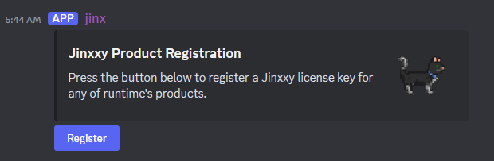
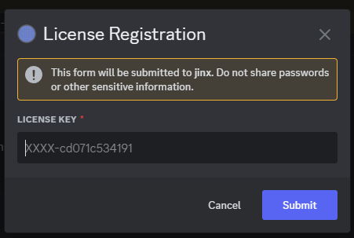
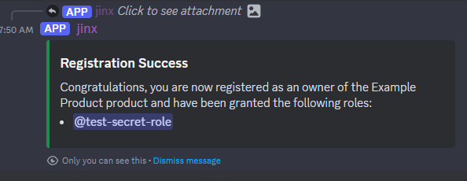
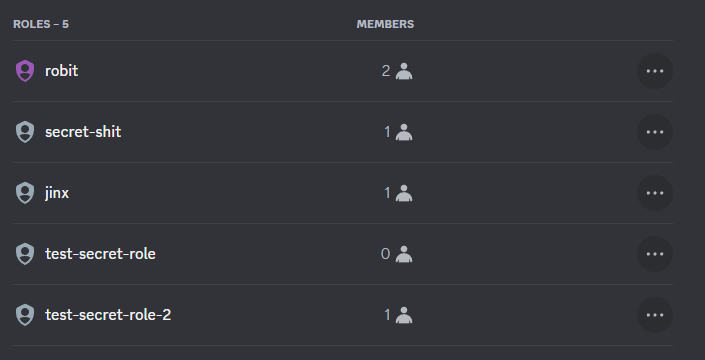
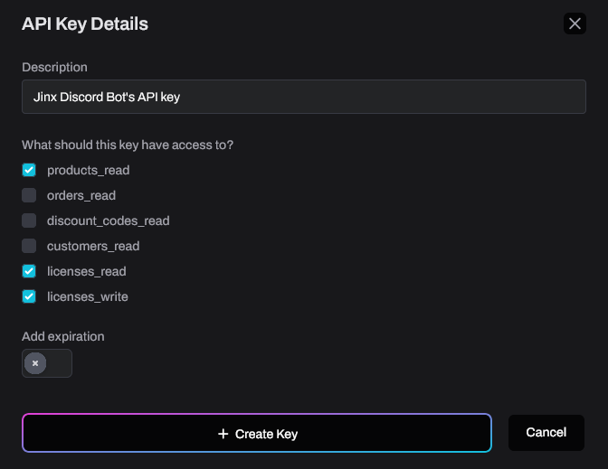

# Jinx

Jinx is a Discord bot that grants roles to users in your server when they register [Jinxxy](https://jinxxy.com/)
license keys.

<!-- For support, [open an issue][issues] or [join our Discord][discord].-->

> [!WARNING]
> Jinx is in a pre-release state and has only been partially validated against the Jinxxy API.
> You may experience bugs with this software: please report them [here on GitHub][issues] or [in our Discord][discord].

> [!IMPORTANT]
> **[Click here to install the bot][bot install]**  
> <small>(and then go follow the [installation instructions](#installation))</small>

## User Experience

A user clicks the "Register" button:

Next, the user is presented with a prompt to enter a license key:

Finally, if a valid license was provided then the user is granted any roles associated to their product. A confirmation
message is shown:

## Installation

> [!IMPORTANT]
> **[Click here to install the bot][bot install]**  
> <small>(if you haven't already done so)</small>

When installing the bot, a "jinx" role will be automatically created in your server.
**You must ensure sure the "jinx" role is listed above any roles you want Jinx to manage.**
For example, in the screenshot below Jinx can only manage "test-secret-role" and "test-secret-role-2".

Next, go to [Jinxxy's API Keys page](https://jinxxy.com/my/dashboard/settings/api-keys) and create a new
API key with products_read, licenses_read, and licenses_write (see
[explanation of permissions](docs/permissions-used.md) to learn why we need these). Uncheck the expiration checkbox.
Make note of the API key when you create it: we'll need it shortly. The form should look like this:

Finally, back in your Discord server run the following slash commands:

1. Run the `/init <api_key>` command in your Sever and provide your API key. This is one-time setup.
2. Run the `/link_product` command for each Jinxxy product you want to link to a role. You may have multiple products
   that grant the same role, and products can grant multiple rows.
3. Check your work using `/list_links`
4. When you're ready, run `/create_post` in the channel of your choosing to have Jinx create a button users can click to
   register license keys. You may create multiple posts this way. If you update your Jinxxy username or profile picture
   you may want to delete and recreate the post to update it.

I recommend testing everything with a test license. You can create a 100% discount code on an unlisted test product to
create test licenses.

### Self-hosting

You may also wish to self-host this bot. [Self-hosting instructions](docs/self-hosting.md) are provided, but the process
is moderately technical.

## Administrator Commands

Jinx comes with several slash commands for server administrators and moderators.

| Command                                | Required Permission | Description                                                                                          |
| -------------------------------------- | ------------------- | ---------------------------------------------------------------------------------------------------- |
| `/init [api_key]`                      | Manage Server       | Set up Jinx for this Discord server.                                                                 |
| `/set_log_channel [channel]`           | Manage Server       | Set (or unset) channel for bot to log to.                                                            |
| `/link_product`                        | Manage Roles        | Link (or unlink) a product and a role. Activating a license for the product will grant linked roles. |
| `/list_links`                          | Manage Roles        | List all product→role links.                                                                         |
| `/create_post`                         | Manage Roles        | Create post with buttons to register product keys.                                                   |
| `/user_info <user>`                    | Manage Server       | Query license information for a Discord user.                                                        |
| `/license_info <license>`              | Manage Roles        | Query activation information for a license.                                                          |
| `/lock_license <license>`              | Manage Roles        | Lock a license, preventing it from being used to grant roles.                                        |
| `/unlock_license <license>`            | Manage Roles        | Unlock a license, allowing it to be used to grant roles.                                             |
| `/deactivate_license <user> <license>` | Manage Roles        | Remove a user's activation of a license. This does not remove roles!                                 |
| `/version`                             | None                | Shows version information about Jinx.                                                                |
| `/help`                                | None                | Shows help information about Jinx.                                                                   |

> [!TIP]
> - The required permission/role for a command can be customized in the server's Integration settings.
> - `/user_info` can also be used from the context menu: look for "Apps"/"List Jinxxy licenses" when you right-click a
>   user in your server.
> - In the event that a Jinx update causes commands to become outdated, you can run `/init` again with no parameters to reinstall all
>   commands to your server.

## License & Legal

jinx is free software: you can redistribute it and/or modify it under the terms of the
[GNU Affero General Public License](LICENSE) as published by the Free Software Foundation, either version 3 of the
License, or (at your option) any later version.

jinx is distributed in the hope that it will be useful, but WITHOUT ANY WARRANTY; without even the implied warranty of
MERCHANTABILITY or FITNESS FOR A PARTICULAR PURPOSE. See the [GNU Affero General Public License](LICENSE) for more
details.

A full list of dependencies is available in [Cargo.toml](Cargo.toml), or a breakdown of dependencies by license can be
generated with `cargo deny list`.

---

The [publicly installable bot][bot install] provided by us is available under our [Terms of Service](TERMS.md) and [Privacy Policy](PRIVACY.md).

[bot install]: https://discord.com/oauth2/authorize?client_id=1270708639145001052
[discord]: https://discord.gg/aKkA6m26f9
[issues]: https://github.com/zkxs/jinx/issues
