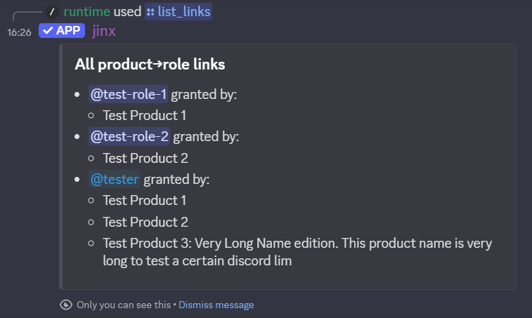

# Frequently Asked Questions

## For Users

### I've left and rejoined a server and lost my roles. Can I get them back?

Yes, just re-register your license key again. As long as you're using the same Discord account that originally registered
the license, Jinx will happily grant the roles again.

### I've lost my Discord account and had to make a new one. Can I move my Jinxxy license?

You will have to talk to the server owner. They can run `/deactivate_license <user> <store_name> <license>` to free up your old
license for re-registration by your new account.

### Jinx is giving me an error

Common errors are documented in the [troubleshooting page](troubleshooting.md). If something really weird or confusing
is happening please report the issue [here on GitHub][issues] or ping the `@bot developer` role [in our Discord][discord].

## For Creators

### Is there an alternative to having a different role for each product?

Yes! If you just want something simple, `/set_wildcard_role` will grant the given role for _any_ license in your store.

If you want to get fancy, multiple products can grant the same role, and a single product can grant multiple roles. Just
run the `/link_product` command multiple times to create as many product/role links as you want. You can get pretty
elaborate:

For even more ways to link roles, including distinguishing between versions of a product, see the
[role management commands](command-reference.md#role-management-commands).

### I've changed my product→role links. Will Jinx automatically update granted roles?

Jinx _never_ removes roles, so any roles granted by Jinx that you want removed will be need to be fixed by you manually.

To retroactively grant roles using your currently product→role links to users who already have a license activated,
simply run `/grant_missing_roles`. You can do this for a single role, or omit the role parameter to have Jinx re-check
all roles.

### Are there plans to add support for other marketplaces?

Not at this time. If the
[Give Creators the Ability to Manually Assign Licenses](https://jinxxy.canny.io/feature-requests/p/give-creators-the-ability-to-manually-assign-licenses)
canny feature request is ever implemented I may revisit this to create some kind of Gumroad -> Jinxxy migration feature.

### Can I self-host the bot?

Yes! Jinx is fully open source, so you can do whatever you want with it! [Self-hosting instructions](self-hosting.md)
are available, but please note the process is moderately technical and is neither needed nor recommended for typical users.

[discord]: https://discord.gg/aKkA6m26f9
[issues]: https://github.com/zkxs/jinx/issues
