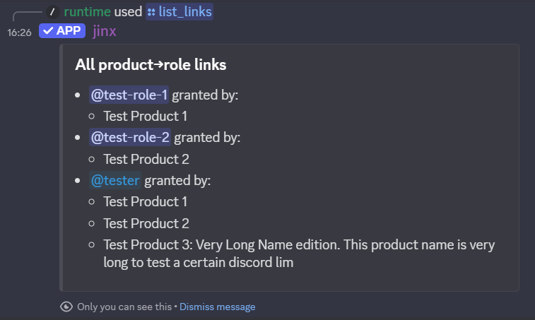

# Frequently Asked Questions

## For Users

### I've left and rejoined a server and lost my roles. Can I get them back?

Jinx should automatically restore your roles if you rejoin a server, but if for some reason this fails you can
manually re-register your license key again using the register button.

### I've lost my Discord account and had to make a new one. Can I move my Jinxxy license?

You will have to talk to the server owner. They can run `/deactivate_license <user> <store_name> <license>` to free up your old
license for re-registration by your new account.

### Jinx is giving me an error

Common errors are documented in the [troubleshooting page](troubleshooting.md). If something really weird or confusing
is happening please report the issue [here on GitHub][issues] or ping the `@bot developer` role [in our Discord][discord].

## For Creators

### Is there an alternative to having a different role for each product?

Yes! If you just want something simple, `/set_wildcard_role` will grant the given role for _any_ license in your store.

If you want to get fancy, multiple products can grant the same role, and a single product can grant multiple roles. Just
run the `/link_product` command multiple times to create as many product/role links as you want. You can get pretty
elaborate:

For even more ways to link roles, including distinguishing between versions of a product, see the
[role management commands](command-reference.md#role-management-commands).

### I've changed my product→role links. Will Jinx automatically update granted roles?

Jinx _never_ removes roles, so any roles granted by Jinx that you want removed will be need to be fixed by you manually.

To retroactively grant roles using your current product→role links to users who already have a license activated,
simply run `/grant_missing_roles`. You can do this for a single role, or omit the role parameter to have Jinx re-check
all roles.

### Someone has refunded a product. How does Jinx handle this?

Unfortunately the Jinxxy API does not provide any way to subscribe to refund events, so Jinx is unable to handle this
automatically. If you are notified of a refund and are concerned the customer may be abusing Jinx for Discord role
benefits, do the following:

1. Find the license key for the refunded order in your Jinxxy dashboard
2. Use the `/lock_license` command to prevent further use of the license. The Jinxxy API does not currently invalidate
   refunded licenses, so you **must** take this step to prevent Jinx from granting roles in the future.
3. Use the `/license_info` command to learn if the license has already been used in your Discord, and if so who by.
4. Take any desired moderation action against that Discord user.

### Are there plans to add support for other marketplaces?

Not at this time. See the [store support issue](https://github.com/zkxs/jinx/issues/41) for more details.

### Can I self-host the bot?

Yes! [Self-hosting instructions](self-hosting.md) are available, but please note the process is moderately technical and
is neither needed nor recommended for typical users.

[discord]: https://discord.gg/aKkA6m26f9
[issues]: https://github.com/zkxs/jinx/issues
