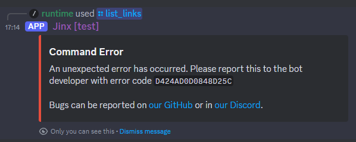

# Jinx Troubleshooting

If Jinx is behaving unexpectedly or giving you an error, check the common scenarios below.
You can try `Ctrl+F`ing for your error text to see if anything matches.

If you are debugging on behalf of another user, please get a screenshot of the error message from them so you can confirm nothing is being miscommunicated.

## Invalid License

Error text:

> ### Jinxxy Product Registration Failed
> The provided Jinxxy license key was not valid or is already in use

Jinx attempted to verify your license key against the Jinxxy API, but verification failed. This can occur if:

- The license is entered incorrectly. Case and punctuation are important: I advise copy/pasting the license directly from your email receipt or [Jinxxy inventory page](https://jinxxy.com/my/inventory).
- The license is already registered to another Discord user. If you believe your license has been erroneously registered to the wrong Discord user, you can ask the Discord server owner to use the `/deactivate_license` command for you.
- The license is valid, but for the wrong store. Verify your license key actually matches the store associated with the Discord server you are using Jinx in.

## Wrong Bot

Error text:

> ### Jinxxy Product Registration Failed
> The provided Jinxxy license key was not valid or is already in use.
> 
> **This bot only supports Jinxxy keys**, but you appear to have provided a Gumroad key. Please confirm you are providing the correct value to the correct bot. Jinxxy keys should look like `XXXX-cd071c534191` or `3642d957-c5d8-4d18-a1ae-cd071c534191`.

This is the same as the above error, except Jinx is fairly certain you have provided an invalid license format. This occurs if you provide a license key that looks like:

- A Gumroad key. You probably meant to provide the key to the [GumCord](https://github.com/benaclejames/GumCord) bot.
- A Payhip key.
- some other unknown value that is not formatted like a Jinxxy short or long key.

Jinx **only** supports Jinxxy license keys: license keys from other digital marketplaces are not compatible.

## Unhandled Error

Error text:

> ### Command Error
> 
> An unexpected error has occurred. Please report this to the bot developer with error code `D50B6BCE19BB8608`
> 
> Bugs can be reported on [our GitHub](https://github.com/zkxs/jinx/issues) or in [our Discord](https://discord.gg/aKkA6m26f9)

This indicates a bug in the implementation of the command. Please report the issue [here on GitHub][issues] or [in our Discord][discord].

## Bot Outage

Error text:

> The application did not respond

This indicates that the bot is down or there is a serious bug with a command. To troubleshoot:

1. Try using a simple command like `/help` which just displays text. If `/help` works but some other command is broken, that indicates the bot is fine but there is a serious bug with that command. Please report the issue [here on GitHub][issues] or [in our Discord][discord].
2. Wait a few minutes to see if the `/help` command recovers. If it recovers, there was likely a temporary networking issue between Discord and the bot.
3. If `/help` continues to fail after several retries, it is likely that the bot is crashed or hung. Please report the issue [here on GitHub][issues] or ping the `@bot developer` role [in our Discord][discord], as this will likely require a bot developer to manually restart the bot.

[discord]: https://discord.gg/aKkA6m26f9
[issues]: https://github.com/zkxs/jinx/issues
